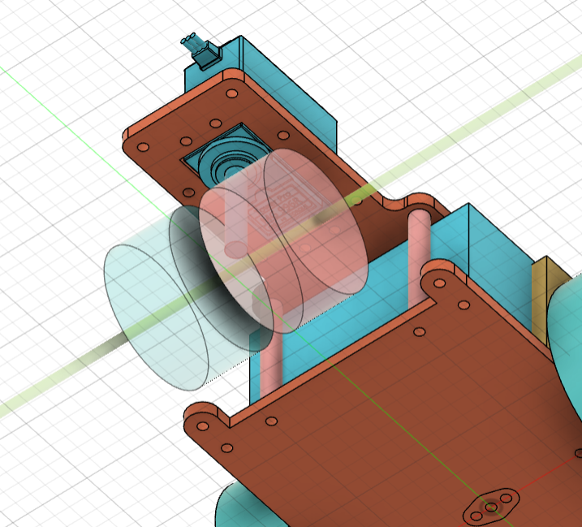
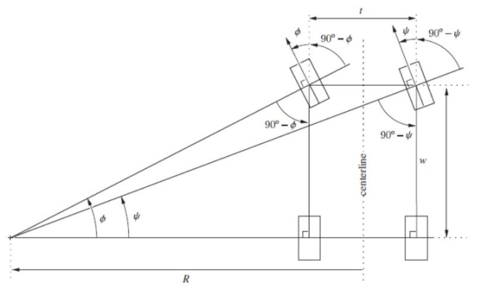
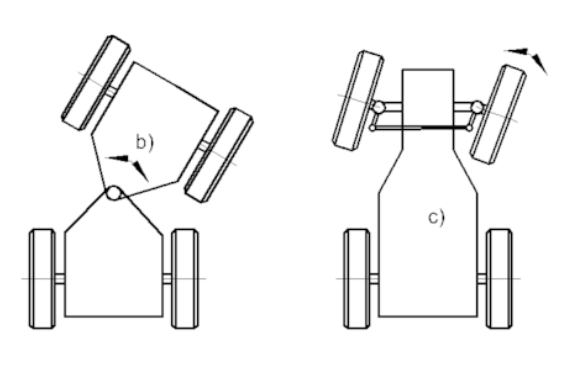
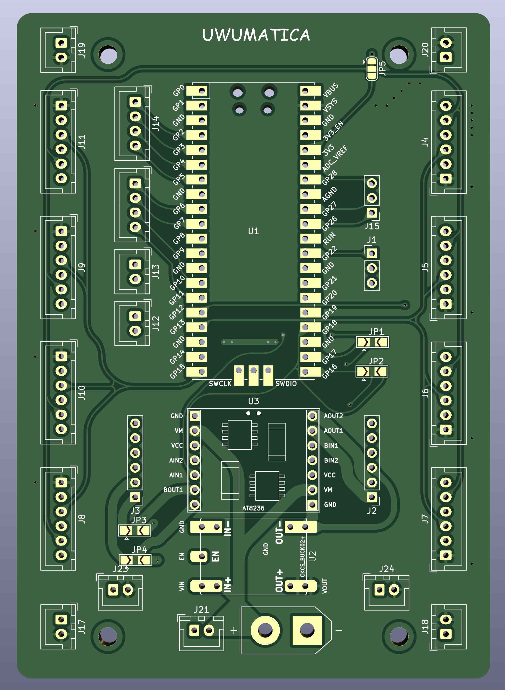
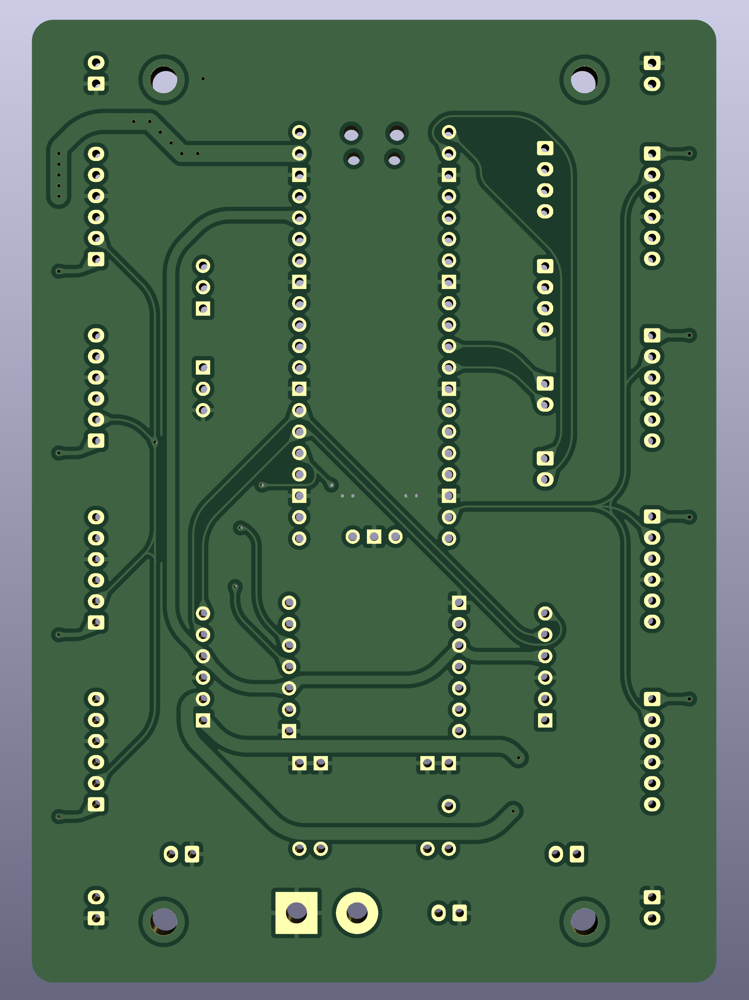
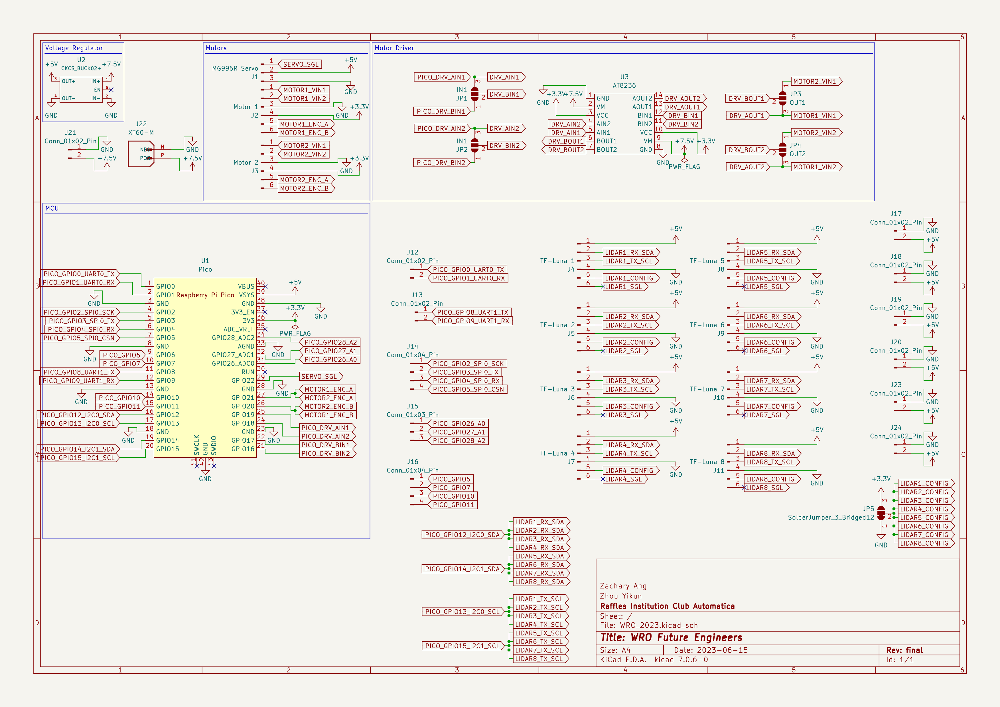
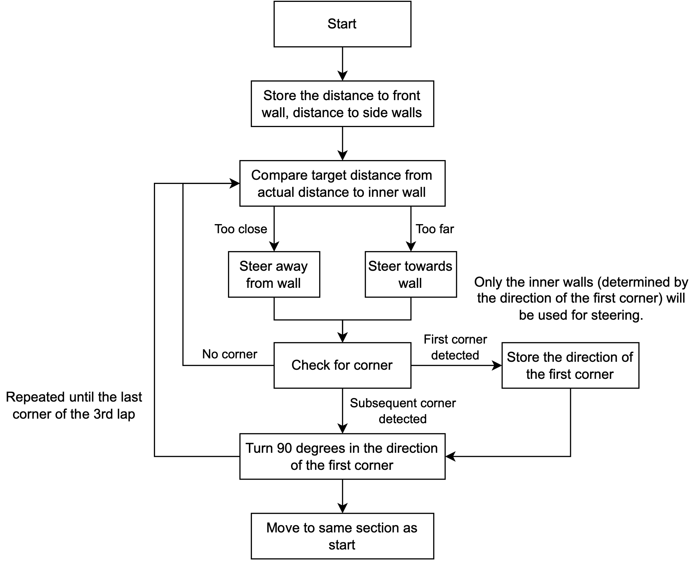
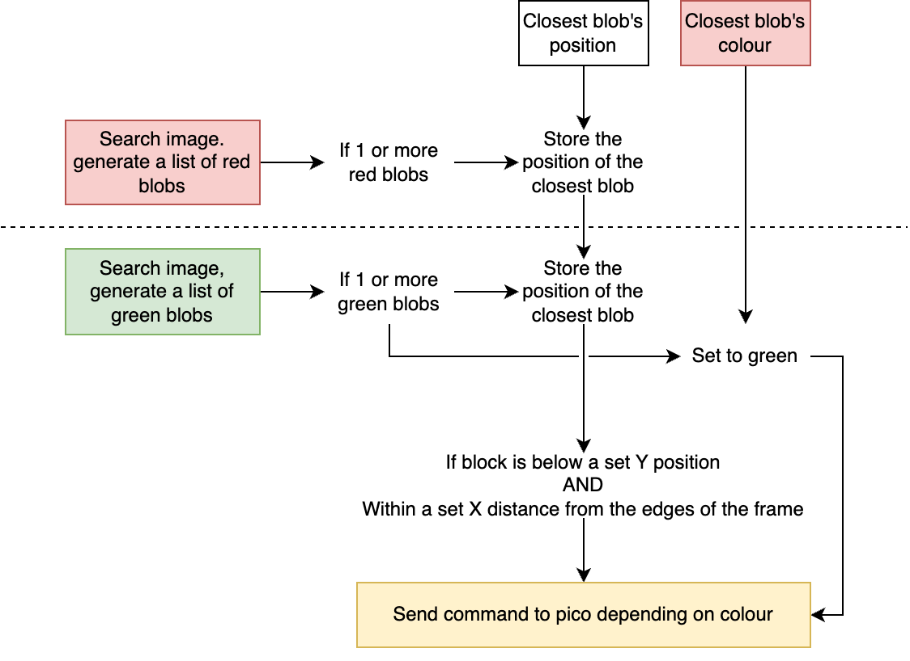
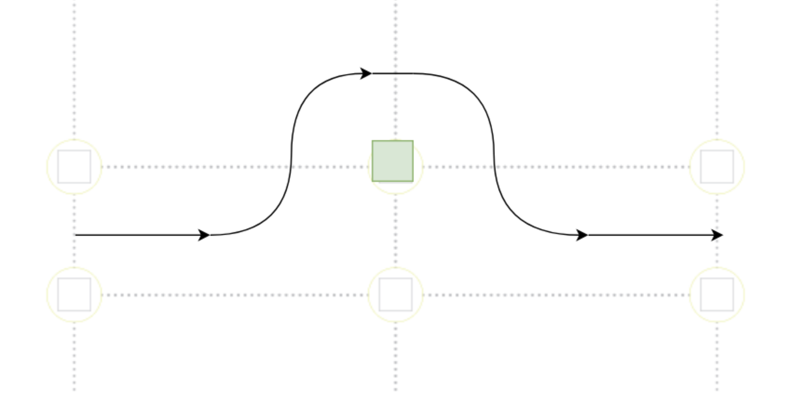

# Contents
1. Hardware Overview
2. Mobility Management
3. Power and Sense
4. Obstacle Management
5. Code Style Guidelines

# Introduction

Team ID: `FE0901`

Team Name: `raffles institution team 3`

Team Members:
- Zhou Yikun
- Zachary Ang

# 1. Hardware Overview

## Bill of Materials (BOM)

| Description       | Brand        | Model                       | Number | Others                                                                                                                                                                                                                                                                                                                              |
| ----------------- | ------------ | --------------------------- | ------ | ----------------------------------------------------------------------------------------------------------------------------------------------------------------------------------------------------------------------------------------------------------------------------------------------------------------------------------- |
| Motor             | YFROBOT      | GM25-12CPR                  | 1      | Contains Encoder, [Link](https://yfrobot.com/products/metal-gearmotor-ga25-12v-with-16-cpr-encoder), , [Doc 1](https://files.seeedstudio.com/wiki/Skeleton_Bot-4WD_hercules_mobile_robotic_platform/res/Specifications_for_Motor.pdf), [Doc 2](https://osoyoo.com/picture/mecanum_wheel_robotic/GM25-370-motor%20specification.pdf) |
| Servo             | Tower-Pro    | MG996R                      | 1      | [Schematics](https://www.electronicoscaldas.com/datasheet/MG996R_Tower-Pro.pdf)                                                                                                                                                                                                                                                     |
| Motor Driver      | -            | AT8236                      | 1      |                                                                                                                                                                                                                                                                                                                                     |
| Microcontroller   | Raspberry Pi | Pico                        | 1      |                                                                                                                                                                                                                                                                                                                                     |
| Voltage Regulator | CKCS         | CKCS-BK-2                   | 1      | 5V4A Output                                                                                                                                                                                                                                                                                                                         |
| LiDAR             | -            | TF-Luna                     | 5      |                                                                                                                                                                                                                                                                                                                                     |
| PCB               | JLCPCB       | -                           | 1      |                                                                                                                                                                                                                                                                                                                                     |
| Camera            | OpenMV       | M7                          | 1      |                                                                                                                                                                                                                                                                                                                                     |
| Compass           | -            | GY-273                      | 1      | Labelled HMC5883L, using QMC5883L                                                                                                                                                                                                                                                                                                   |
| Compass           | -            | GY-271                      | 1      | Uses QMC5883L                                                                                                                                                                                                                                                                                                                       |
| LiPo Battery      | Turnigy      | Nano-tech 1300mAh 3S 45~90C |        |                                                                                                                                                                                                                                                                                                                                     |
|                   |              |                             |        |                                                                                                                                                                                                                                                                                                                                     |

# 2. Mobility Management

## Motor

Motor used for propulsion was the GM25-12CPR. It had a relatively low stall current of 2A, which allowed us to use a smaller motor driver and design the PCB for a lower current.

It was mounted to the vehicle using the included metal bracket, and placed lower down, along with other heavy components, to improve stability.

The gearbox attached to the motor was mounted inline with the motor which reduced the vertical space taken up by the motor, at the expense of restricting the possible orientations in can be mounted.

![[../attachments/gear-box.png]]

### Motor Driver

We purchased the motor before deciding on which motor driver to use to power the motor. Unbeknownst to us at that time, this was a bad idea. Instead, we should have decided on a motor driver, before finding a suitable motor.

After making the purchase for the motor, we started looking for a suitable motor driver. To do so, we have to find the maximum current which the motor would run at, which would be the stalling current. However, this is where the nightmare began. There was conflicting information for the motor, even different pages (motor in a kit set info page, and individual motor info page) from the same manufacturer (YFROBOT) had different information about the motor. Then, generalising the search to the generic motor itself (the GM25-370), we discovered even more conflicting information.

In the end, we decided to take the highest stalling current that we could find on the internet, so that our motor driver would not just burn up immediately when the motor stalls. The value was 4A at 8.4V, and 6A at 12V.

Initially when the motor arrived, we tested it with a motor driver that we had on hand - the [SparkFun TB6612FNG](https://www.sparkfun.com/products/14451). It has a rated maximum sustained current of 1.2A per channel and a peak current of 3.2A per channel. The maximum sustained value was much lower than the supposed stall current of the motor, but the peak current seemed promisingly high to be used, so we continued with out test and thankfully, the driver did not burn up during out testing. We even researched and discovered that we could connect and join the two channel inputs and outputs together, to double the maximum sustained and peak current, literally. However, we decided to find a better alternative in mind of the (low but still present) possibility of the motor driver, a critical component, malfunctioning.

Then, after research, we discovered the AT8236, which has built-in overcurrent protection, and a maximum sustained and peak output current of 4A and 6A respectively. This was as high as our stall current could potentially be. Besides, for additional peace of mind, we designed the PCB in a way that would allow us to combine the two channels to achieve double current output, by simply connecting two solder pads on the PCB. Up til now, it seems that a single channel is more than sufficient for the motor and we have not needed to use the combined dual channel output.

## Steering - Servo

The vehicle has a single servo rotating the steering axle through a single shaft, as opposed to more conventional steering geometries with multiple linkages and pivots, cutting down on complexity.

The steering axle was designed to be as close as possible to the drive axle to minimise the turning radius, while allowing sufficient space for the steering wheels to rotate freely.
   

Given that $\text{Turn radius} \approx D\tan({90\degree-\theta\degree})$, where $D$ is the distance between the steering and driving axle, and $\theta$ is the steering angle, minimising $D$ would be ideal. 

## Vehicle Chassis Design

The chassis was designed to use articulated steering, which allowed for larger steering angles while keeping the steering mechanism relatively simple. 
   

i mean the current design is articulated steering just that basically one side has nothing

and the other wise has the rest of the bot
like in b is shows it being split in the middle
but in ours its basically split at the servo and theres almost nothing on the other side

The baseplate, upper plate, and PCB were designed to be connected via M3 standoffs, which allowed for flexibility in adjusting the height, and made swapping components easier.

# 3. Power and Sense

## Power

2. Power passes through a 5V regulator before being distributed to the servo, sensors and Raspberry Pi Pico used as a microcontroller.

- 12V LiPo battery powers:
    - Motor driver to supply power to the single motor
    - Voltage regulator that outputs 5V with a maximum sustained current of 4A
- Resultant 5V from voltage regulator powers:
    - Sensors (LiDAR and Compass)
    - Microcontroller (Raspberry Pi Pico)
    - Camera (OpenMV M7)
    - Servo
    - Motor driver signal
    - Encoder on the motor

### Choice of LiPo batteries

- LiPo
    - suitable voltage - closest to most common voltage used by components
    - 18650 - 2x3.7V?
    - if really needed - check conversion efficiency of voltage regulator

# Communication
Various sensors, and the camera, communicate with the main microcontroller, Raspberry Pi Pico, via multiple protocols.
Inputs
- LiDAR: I2C
    - Each LiDAR is either set to a different I2C address, or run on a different I2C bus of the Pico
- Camera: UART
- Compass: I2C
    - One compass per I2C bus for failsafe
- Encoder: digital HIGH/LOW signals
Outputs
- Motor driver: PWM signal
- Servo: A form of PWM signal, using the Arduino `Servo` library

# Choice of Components

## Microcontroller

The Raspberry Pi Pico was chosen for various reasons:
- Affordability
    - Pico is extremely affordable, priced at 4.00 USD each, so the overall cost would be reduced especially when more Picos are to be purchased for backup
- Fast processor and Memory
    - Pico has a dual-core Arm Cortex-M0+ processor that runs at 133 Mhz, which is much faster than alternatives like the Arduino Nano (16 Mhz). While it is slower than the Teensy 4.0 which runs at 400 Mhz, it has two cores instead of one, allowing for multicore operations. This is not to ignore the price advantage Pico has over alternatives.
        - With regards to the dual core processor, we actively took advantage of it, by running the movement control code (i.e. movement motor and steering via servo) on the second core while running the main loop gathering and processing data from sensors to make movement decisions on the main core.
- Variety of Protocols and GPIO Pins
    - GPIO pins on the Pico are multi-purpose, and each pin could be used with almost any supported protocol, including 2 x I2C buses, 2 x SPI buses, 2 UART ports, 16 x PWM channels and 3 x analog ports.
        - More interfaces available than alternatives such as the Arduino Nano and 
        - Such a multitude of protocols allow us to connect any peripherals such as sensors we want.
- Compatibility with Arduino
    - We are already familiar with the Arduino ecosystem, so finding a microcontroller that is compatible with Arduino is key
- Size
    - Despite Pico's small size, it still packs in a lot of capabilities

## Distance ranging sensor - LiDAR

LiDAR was chosen instead of alternative such as ultrasonic sensor due to its accuracy. Ultrasonic sensors, from past experience, have always been very unreliable, with values jumping around frequently, or even the entire sensor malfunctioning and causing the entire I2C bus to hang.

Besides, ultrasonic sensors may not work as well as LiDAR in this game field, where long distance ranging is required, and the field is huge (3m by 3m). Ultrasonic sensors may also interfere with each other, especially when we need to use multiple of them.

While LiDAR readings may not be entirely foolproof, and still prone to errors due to reflectivity of the target object, it is mostly accurate for our use.

Additionally, we have LiDAR sensors available on hand, and we have prior experience working with them, so it was a natural choice.

The layout of the LiDAR was decided.

3. Front and side facing LiDARs are used to measure the distance to the walls. The TFLunas used have a maximum range of 2m which is sufficient for detecting the side walls but may at times not have enough especially for the front facing LiDAR.

2 lidar to estimate heading based on wall, compared with the compass reading to detect when the 2 lidars are not both detecting a same side of the same wall (i.e. there is a corner)

## Battery

1. The vehicle is powered off a single 3-cell Lithium Polymer (LiPo) battery, which allows for high peak current draw in excess of 10A and is easy to design around, given its rectangular shape.

18650 was considered 
did not need a high voltage like the 12V LiPo we had, and it could be charged more easily

and we even purchased a carrier board for testing and prototyping
however, concerns over the overcurrent protection (2A built-in) and 
lack of time in designing custom carrier board with protection

size was larger than a lipo

many lipo around readily available, from use in other competitions

decided against 18650, and went with lipo instead in the end.

## Camera

1. Block detection is done through an OpenMV M7 mounted on the front of the vehicle. It is quite easy to interface with and was easy to use, given the libraries provided with the OpenMV IDE.
2. We were initially considering using a Raspberry Pi Camera Module but decided against it as it had issues with latency.

1. [[Raspberry Pi Camera]] with [[OpenCV]]
2. OpenMV but we no have
3. Pixy

- Dual/Stereo Cameras

## PCB

While prototyping, we realised that we require the use of many sensors.

three main solutions exist, 
and connecting them via jumper wires would not be reliable, while soldering by hand using protoboards would take too much time.

We decided to design and make a PCB, since

Manufacturing with JLCPCB was cheap and quick. Compared to the time needed for other solutions

Here are some renders of the PCB.

Front:

Back:

Below is the schematics for the PCB. (A full image is available on GitHub too under `schemes/`)

# 4. Obstacle management

## Open Challenge

1. For the open round, the vehicle attempts to maintain a fixed distance from the inner wall. 2 LiDARs, mounted at the front and rear of the vehicle, face the inner wall and are used to gauge the vehicle's proximity and angle with respect to the wall. Corners are detected based on the disparity between the 2 LiDAR readings with the LiDARs, with the forward LiDARs detecting the sudden increase in range before the rear LiDARs.
2. When the vehicle is started, it measures the range to the front and sides to get its start position, which is used to determine its starting section.

## Obstacle Challenge

![[../attachments/obstacle-challenge-logic.png]]

1. For the obstacle round, blocks were detected using the blob identification library that came with the OpenMV software.
   
3. The all the green and red blobs are compared and the block whose centroid lies the lowest in the camera's frame is used as the closest block.
4. Once the closest block falls below a preset Y threshold, the OpenMV sends a command the the Pico. The Pico then performs 4 turns to evade the block and afterwards, return to the initial path.
   

# 5. Code Style Guidelines
- Annotate code where possible.
- Delete unused code unless intended for immediate use.
- Avoid long equations, ie. break them down into a few statements.
- Naming:
    - `PascalCase` for class names.
    - `camelCase` for normal variable names.
    - `UPPER_SNAKE_CASE` for definitions.
    - Capitalise acronyms.
- OOP
