# Contents
1. Hardware Overview
2. Mobility Management
3. Power and Sense
4. Obstacle Management
5. Code Style Guidelines

# Introduction

Team ID: `FE0901`

Team Name: `raffles institution team 3`

Team Members:
- Zhou Yikun
- Zachary Ang

A copy of this Engineering Journal can also be found on [GitHub](https://github.com/PorridgePi/WRO-FE-2023/blob/main/docs/Engineering%20Journal.md).

Other notes that we took are also found in the `docs/` subdirectory.

# 1. Hardware Overview

## Bill of Materials (BOM)

| Description       | Brand        | Model                       | Number | Others                                                                                                                                                                                                                                                                                                                              |     |
| ----------------- | ------------ | --------------------------- | ------ | ----------------------------------------------------------------------------------------------------------------------------------------------------------------------------------------------------------------------------------------------------------------------------------------------------------------------------------- | --- |
| Motor             | YFROBOT      | GM25-12CPR                  | 1      | Contains Encoder, [Link](https://yfrobot.com/products/metal-gearmotor-ga25-12v-with-16-cpr-encoder), , [Doc 1](https://files.seeedstudio.com/wiki/Skeleton_Bot-4WD_hercules_mobile_robotic_platform/res/Specifications_for_Motor.pdf), [Doc 2](https://osoyoo.com/picture/mecanum_wheel_robotic/GM25-370-motor%20specification.pdf) |     |
| Servo             | Tower-Pro    | MG996R                      | 1      | [Schematics](https://www.electronicoscaldas.com/datasheet/MG996R_Tower-Pro.pdf)                                                                                                                                                                                                                                                     |     |
| Motor Driver      | -            | AT8236                      | 1      |                                                                                                                                                                                                                                                                                                                                     |     |
| Microcontroller   | Raspberry Pi | Pico                        | 1      |                                                                                                                                                                                                                                                                                                                                     |     |
| Voltage Regulator | CKCS         | CKCS-BK-2                   | 1      | 5V4A Output                                                                                                                                                                                                                                                                                                                         |     |
| LiDAR             | -            | TF-Luna                     | 5      |                                                                                                                                                                                                                                                                                                                                     |     |
| PCB               | JLCPCB       | -                           | 1      |                                                                                                                                                                                                                                                                                                                                     |     |
| Camera            | OpenMV       | M7                          | 1      |                                                                                                                                                                                                                                                                                                                                     |     |
| Compass           | -            | GY-273                      | 1      | Labelled HMC5883L, using QMC5883L                                                                                                                                                                                                                                                                                                   |     |
| Compass           | -            | GY-271                      | 1      | Uses QMC5883L                                                                                                                                                                                                                                                                                                                       |     |
| LiPo Battery      | Turnigy      | Nano-tech 1300mAh 3S 45~90C |        |                                                                                                                                                                                                                                                                                                                                     |     |                                                                                                                                                                                                            |     |

## Components Wiring Diagram

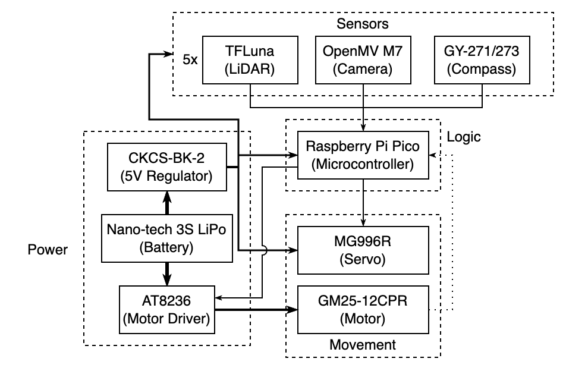

# 2. Mobility Management

## Motor

The motor we used for propulsion was the GM25-12CPR. We chose it because we had a few leftover from other projects, and its speed and specifications appeared suitable for our current competition. While we initially considered other motor options, the availability of the GM25-12CPR made it a practical choice, allowing us to start working on the robot without delays. It was essential to have a motor in hand to begin the design and testing phases.

The motor is mounted to the vehicle using an included metal bracket, and placed lower down, along with other heavy components, to lower the centre of gravity of the robot, and hence improve stability.

The gearbox attached to the motor was mounted inline with the motor which reduced the vertical space taken up by the motor, at the expense of restricting the possible orientations in can be mounted.

### Motor Driver

We purchased the motor before deciding on which motor driver to use to power the motor. Unbeknownst to us at that time, this was a bad idea. Instead, we should have decided on a motor driver, before finding a suitable motor.

After making the purchase for the motor, we started looking for a suitable motor driver. To do so, we have to find the maximum current which the motor would run at, which would be the stalling current. However, this is where the nightmare began. There was conflicting information for the motor, even from the same distributor (motor sold as a kit vs the motor alone had different specs). Then, generalising the search to the generic motor itself (the GM25-370), we discovered even more conflicting information.

In the end, we decided to take the highest stalling current that we could find on the internet, so that our motor driver would not just burn up immediately when the motor stalls. The value was 4A at 8.4V, and 6A at 12V.

Initially when the motor arrived, we tested it with a motor driver that we had on hand - the [SparkFun TB6612FNG](https://www.sparkfun.com/products/14451). It has a rated maximum sustained current of 1.2A per channel and a peak current of 3.2A per channel. The maximum sustained value was much lower than the supposed stall current of the motor, but the peak current seemed promisingly high to be used, so we continued with out test and thankfully, the driver did not burn up during out testing. We even researched and discovered that we could connect and join the two channel inputs and outputs together, to double the maximum sustained and peak current, literally. However, we decided to find a better alternative in mind of the (low but still present) possibility of the motor driver, a critical component, malfunctioning.

We prioritized finding a motor driver that could accommodate the potential higher stall current, which led us to the AT8236 motor driver with built-in overcurrent protection, and a maximum sustained and peak output current of 4A and 6A respectively. This was as high as our stall current could potentially be. This choice offered peace of mind and a safety net against unexpected current spikes.

Besides, for additional peace of mind, we designed the PCB in a way that would allow us to combine the two channels to achieve double current output, by simply connecting two solder pads on the PCB. Up til now, it seems that a single channel is more than sufficient for the motor and we have not needed to use the combined dual channel output.

## Steering - Servo

The vehicle has a single servo rotating the steering axle through a single shaft, as opposed to more conventional steering geometries with multiple linkages and pivots, cutting down on complexity.

The steering axle was designed to be as close as possible to the drive axle to minimise the turning radius, while allowing sufficient space for the steering wheels to rotate freely.
   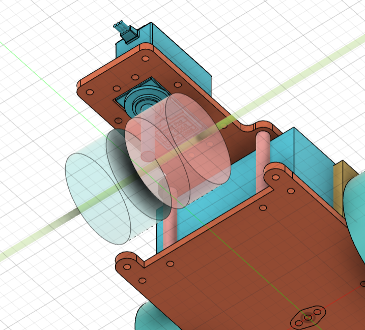

Given that $\text{Turn radius} \approx D\tan({90\degree-\theta\degree})$, where $D$ is the distance between the steering and driving axle, and $\theta$ is the steering angle, minimising $D$ would be ideal. 

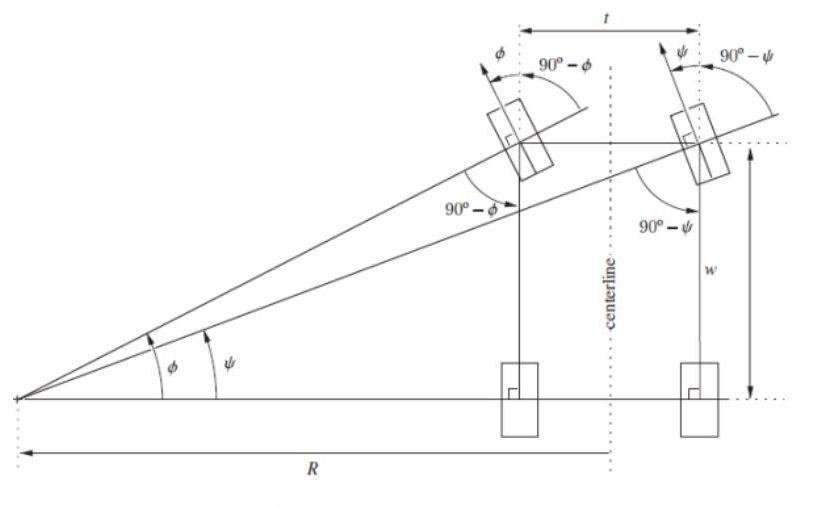

## Vehicle Chassis Design

The chassis was designed to use articulated steering, which allowed for larger steering angles while keeping the steering mechanism relatively simple. 

   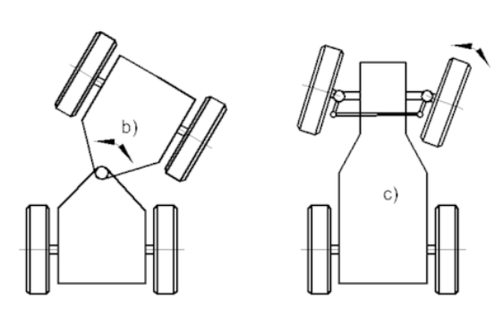

Above is an illustration of articulated steering on the left (b), and typical Ackermann steering on the right (c).

Our robot's design is articulated steering, just that one side of the steering does not have anything while the other has the rest of the components. In (b), it is showing the vehicle being split in the middle, but in our design, the vehicle is basically split at the servo and theres almost nothing on the other side.

Overall, we have standardised all holes to be M3 sized, so different components, including the baseplate, upper plate, and PCB, can be connected via M3 standoffs. This allowed for flexibility in adjusting the height, and made swapping components easier.

# 3. Power and Sense

## Power

Generally, there are 2 main voltages present on the PCB - 12V from the LiPo battery, and 5V that is stepped down from the 12V via a voltage regulator. 

In greater detail:
- 12V LiPo battery powers:
    - Motor driver to supply power to the single motor
    - Voltage regulator that outputs 5V with a maximum sustained current of 4A
- Resultant 5V from voltage regulator powers:
    - Sensors (LiDAR and Compass)
    - Microcontroller (Raspberry Pi Pico)
    - Camera (OpenMV M7)
    - Servo
    - Motor driver signal
    - Encoder on the motor

### Choice of LiPo batteries

- LiPo
    - suitable voltage - closest to most common voltage used by components
    - 18650 - 2x3.7V?
    - if really needed - check conversion efficiency of voltage regulator

# Communication

Various sensors, and the camera, communicate with the main microcontroller, Raspberry Pi Pico, via multiple protocols.

Inputs
- LiDAR: I2C
    - Each LiDAR is either set to a different I2C address, or run on a different I2C bus of the Pico
- Camera: UART
- Compass: I2C
    - One compass per I2C bus for failsafe
- Encoder: digital HIGH/LOW signals

Outputs
- Motor driver: PWM signal
- Servo: A form of PWM signal, using the Arduino `Servo` library

# Choice of Components

## Microcontroller

The Raspberry Pi Pico was chosen for various reasons:
- Affordability
    - Pico is extremely affordable, priced at 4.00 USD each, compared to alternatives like Arduino and Teensy MCUs which can cost easily upwards of tens of US dollars.
    - Hence, the Pico was cost-effective and aligned with our budget constraints. We aimed to strike a balance between performance and cost, and the Pico easily met our requirements without exceeding our budget.
- Fast processor and Memory
    - Pico has a dual-core Arm Cortex-M0+ processor that runs at 133 Mhz, which is much faster than alternatives like the Arduino Nano (16 Mhz). While it is slower than the Teensy 4.0 which runs at 400 Mhz, it has two cores instead of one, allowing for multicore operations. This is not to ignore the price advantage Pico has over alternatives.
        - With regards to the dual core processor, we actively took advantage of it, by running the movement control code (i.e. movement motor and steering via servo) on the second core while running the main loop gathering and processing data from sensors to make movement decisions on the main core.
- Variety of Protocols and GPIO Pins
    - GPIO pins on the Pico are multi-purpose, and each pin could be used with almost any supported protocol, including 2 x I2C buses, 2 x SPI buses, 2 UART ports, 16 x PWM channels and 3 x analog ports.
        - More interfaces available than alternatives such as the Arduino Nano and 
        - Such a multitude of protocols allow us to connect any peripherals such as sensors we want.
- Compatibility with Arduino
    - We are already familiar with the Arduino ecosystem, so finding a microcontroller that is compatible with Arduino is key
- Size
    - Despite Pico's small size, it still packs in a lot of capabilities

## Distance ranging sensor - LiDAR

LiDAR was chosen instead of alternative such as ultrasonic sensor due to its accuracy. Ultrasonic sensors, from past experience, have always been very unreliable, with values jumping around frequently, or even the entire sensor malfunctioning and causing the entire I2C bus to hang.

Besides, ultrasonic sensors may not work as well as LiDAR in this game field, where long distance ranging is required, and the field is huge (3m by 3m). Ultrasonic sensors also tend to interfere with each other, especially when we multiple need to be used simultaneously like in our case.

While the LiDAR readings may not be entirely foolproof, and are still subject to the reflectivity of the target object, they will suffice for our use.

Additionally, we had LiDAR sensors available on hand, and we have prior experience working with them, so it was a natural choice.

Initially, we were only intending on using 3 LiDARs - 2 facing left and right, and one facing forward - however we had issues with detecting corners and decided to install another pair of side facing LiDARs towards the rear. By comparing the reading from the 2 LiDARs, we were able to determine when a corner occured as the first LiDAR would no longer be detecting the wall while the rear LiDAR still was, fixing the corner detection issue.

The TFLunas used have a maximum range of 2m which is sufficient for detecting the side walls but may at times not have enough especially for the front facing LiDAR.

## Battery

The vehicle is powered off a single 3-cell Lithium Polymer (LiPo) battery, which allows for high peak current draw in excess of 10A.

While we considered using 18650 batteries, since 12V was unnecessary, we ultimately decided against it.

We invested in a carrier board while testing the 18650s but it increased the footprint of the batteries and lacked the convenience of a simple XT60 connector, making swapping batteries harder. On top of that, the 2A overcurrent protection severely limited the hardware we could use.

On the other hand, we had many LiPos, was capable of handling plenty of current, and were rectangular, which made designing the bot around them much easier.

## Camera

After some initial research, we shortlisted 3 main choices for a camera.

1. PixyCam
2. Raspberry Pi Camera with OpenCV
3. OpenMV

### PixyCam

We had used PixyCams before but did not enjoy the lack of ability to write your own image processing algorithms. Sometimes the inbuilt algorithm simply could not recognise the colour you pick out via the UI, and you cannot do anything about it but to try and select the colour again.

Hence, we eliminated the PixyCam as a possibility.

### Raspberry Pi Camera

We also considered using a Raspberry Pi Camera Module, but after some trial and error, our inexperience with writing code in OpenCV, as well as the difficulties in setting up a fully functional OpenCV environment on a full-fledged Linux distribution led us to our final decision against using it.

### OpenMV

Finally, we arrived at our choice - the OpenMV M7. We had several of them on hand, and could start testing it immediately.

Compared to the power-hungry OpenCV, OpenMV is highly optimised for efficiency, thus reducing latency which is key in robotics competitions. Besides, OpenMV is tightly integrated with the OpenMV camera hardware, and provides a simplified interface in the form of the OpenMV IDE, which was way easier to use than setting up OpenCV from scratch on the Raspberry Pi.

We eventually settled on mounting an OpenMV M7 on the front of the vehicle, pointing slightly downwards to increase the field of view below the camera.

On a side note, we did consider dual/stereo cameras, and try out Simultaneous Localisation and Mapping (SLAM), but eventually decided not to due to its complexity.

## PCB

While prototyping, we realised that we require the use of many sensors. We initially used bread boards to connect the microcontroller to the peripherals. We realised that connecting them via jumper wires would not be reliable. An alternative was to solder by hand using protoboards, but that would take too much time.

In the end, we decided to design and make a PCB, since manufacturing nowadays, with JLCPCB available, was cheap and quick.

Here are some renders of the PCB.

Front:

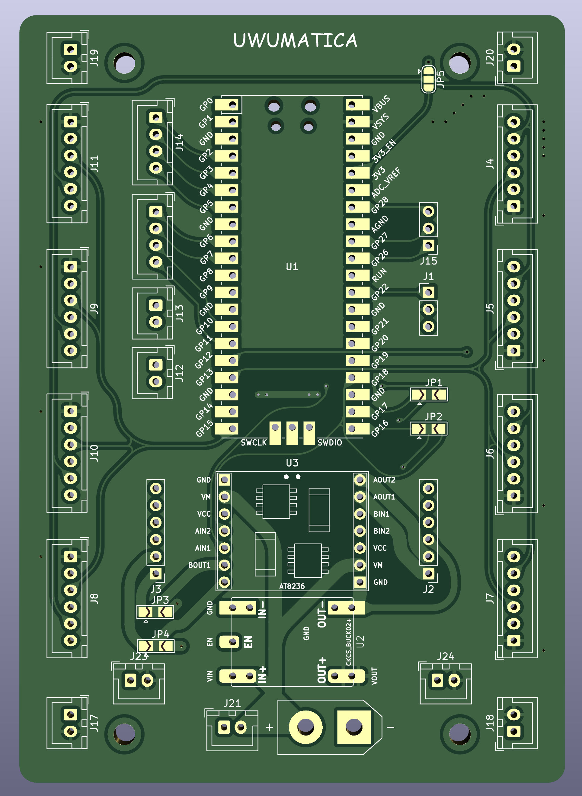

Back:

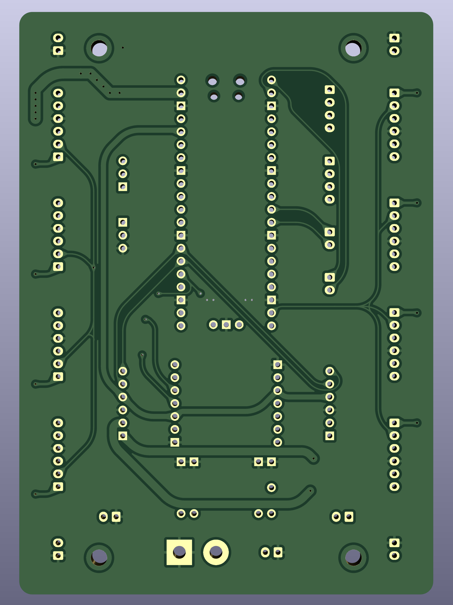

Below is the schematics for the PCB. (A full image is available on GitHub too under `schemes/`)

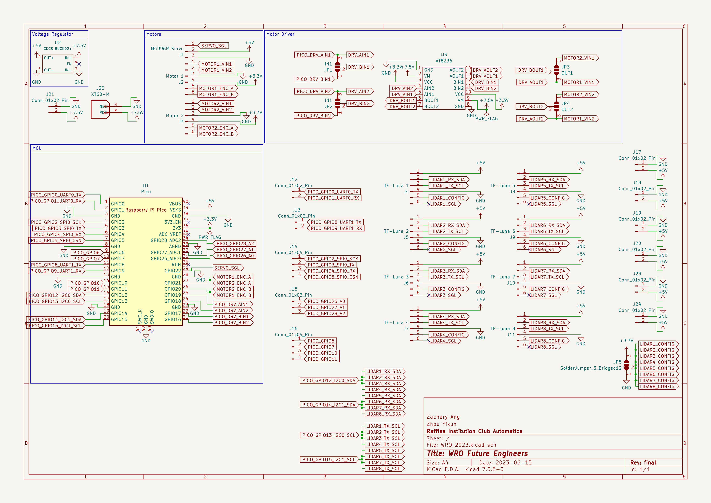

# 4. Obstacle management

## Open Challenge

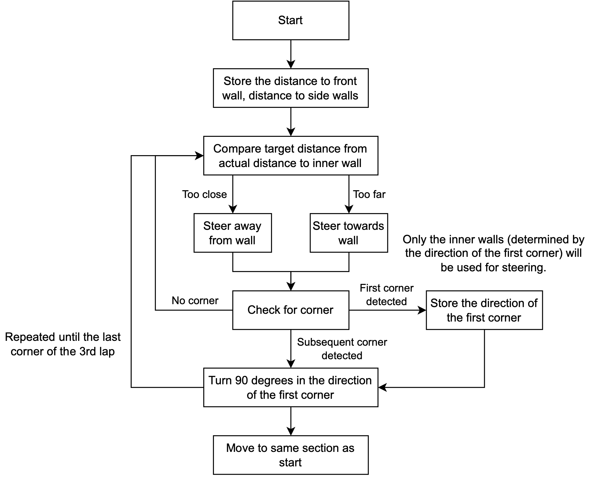

1. For the open round, the vehicle attempts to maintain a fixed distance from the inner wall. 2 LiDARs, mounted at the front and rear of the vehicle, face the inner wall and are used to gauge the vehicle's proximity and angle with respect to the wall. Corners are detected based on the disparity between the 2 LiDAR readings with the LiDARs, with the forward LiDARs detecting the sudden increase in range before the rear LiDARs.
2. When the vehicle is started, it measures the range to the front and sides to get its start position, which is used to determine its starting section.

## Obstacle Challenge

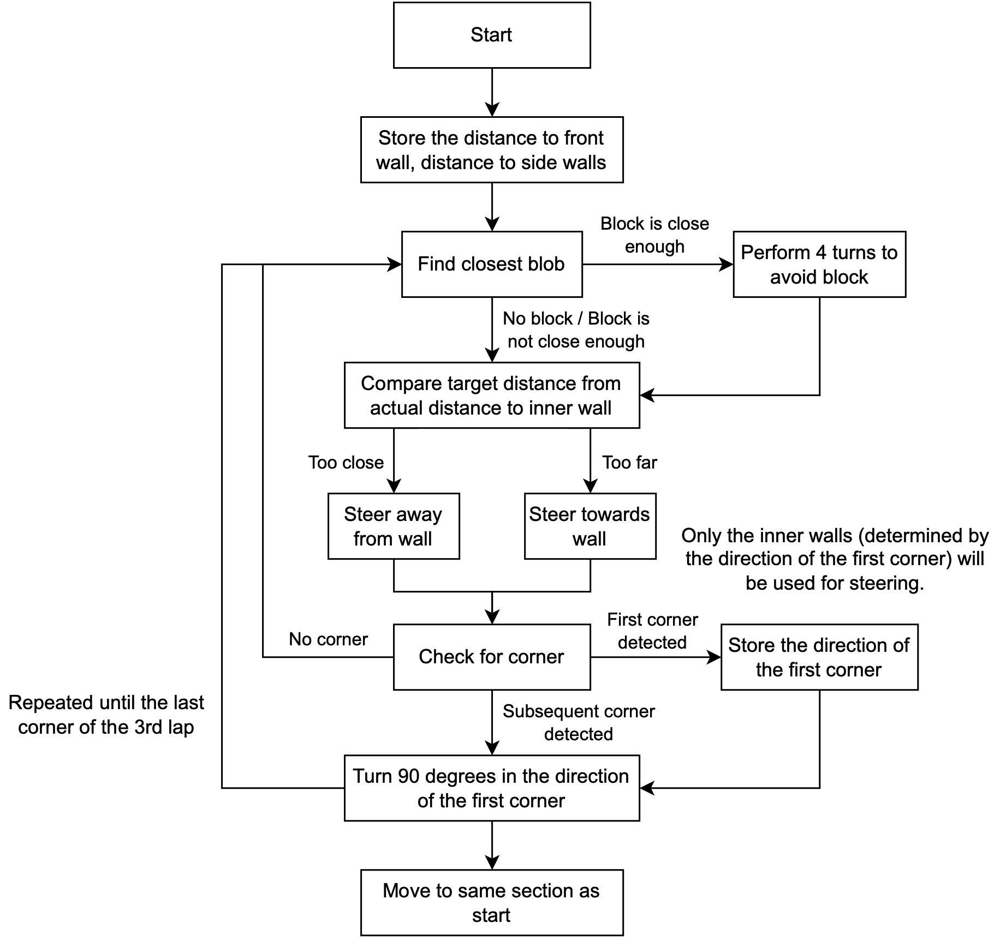

1. For the obstacle round, blocks were detected using the blob identification library that came with the OpenMV software.
   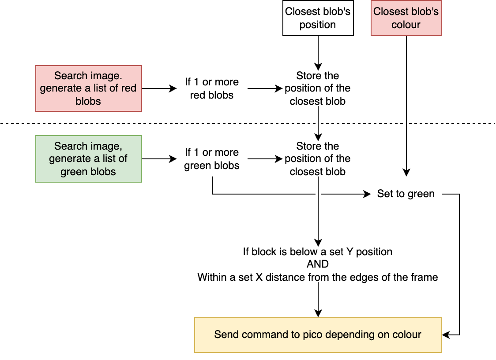
2. The all the green and red blobs are compared and the block whose centroid lies the lowest in the camera's frame is used as the closest block.
3. Once the closest block falls below a preset Y threshold, the OpenMV sends a command the the Pico. The Pico then performs 4 turns to evade the block and afterwards, return to the initial path.
   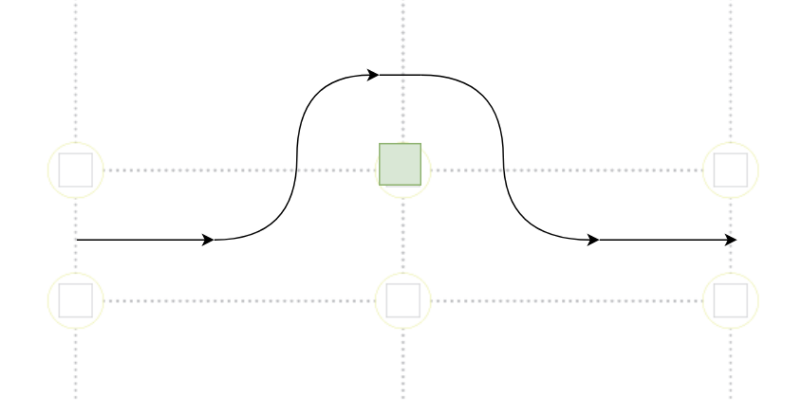

# 5. Code Style Guidelines

From the beginning, we decided to come up with a set of code style guidelines to follow, so as to help maintain consistency in our code, and to ensure the code is readable and maintainable, which is especially important as we work on complex autonomous robot systems.

The guidelines are:
- Annotate code where possible.
- Delete unused code unless intended for immediate use.
- Avoid long equations, ie. break them down into a few statements.
- Naming:
    - `PascalCase` for class names.
    - `camelCase` for normal variable names.
    - `UPPER_SNAKE_CASE` for definitions or constants.
    - Capitalise acronyms.
- Object-oriented programming (with the use of libraries and classes)
