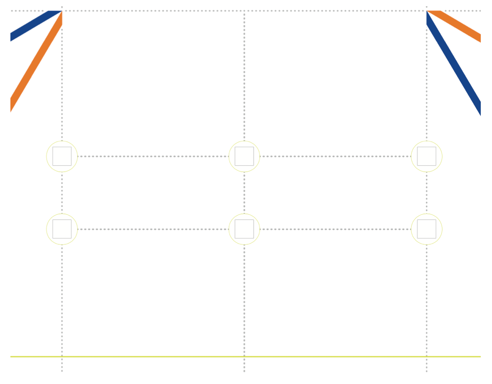

# Focus Areas
- CV + sensor fusion
- open-source hardware
- movement different from differential drive
- optimal strategies
- engineering journal
# Getting Started Guide
- https://world-robot-olympiad-association.github.io/future-engineers-gs/
# Team's Own Work
- Note: 3.7 It is not allowed to use a vehicle’s control program that is (a.) the same or too similar to solutions sold online or (b.) the same or too similar to another solution at the competition and clearly not the own work of the team. This includes solutions from teams of the same institution and/or country. Since manufactured vehicles/sets can be used in the competition, the constructions of vehicles are not checked for plagiarism.
# Game Description
- One car per attempt will try to achieve the best time by driving several laps fully autonomously. The two challenges are the following:
    - Open Challenge: The vehicle must complete three (3) laps on the track with random placements of the inside track walls.
    - Obstacle Challenge: The vehicle must complete three (3) laps on the track with randomly placed green and red traffic signs. The traffic signs indicate the side of the lane the vehicle must follow. The traffic sign to keep to the right side of the lane is a red pillar. The traffic sign to keep to the left side of the lane is a green pillar. The continuation of the vehicle to the third round is indicated by the last traffic sign of the second round. A green traffic sign indicates that the robot must go ahead and continue the third round in the same direction. A red traffic sign indicates that the vehicle must turn around and complete the third round in the opposite direction. The vehicle is not allowed to move or knock down the traffic signs.

The starting direction in which the car must drive on the track (clockwise or counterclockwise) will vary in different challenge rounds. The starting position of the car as well as the number and location of traffic signs are randomly defined before the round (after the check time). The following graphic shows the game field with the game objects.

Straightforward Section
- 6 zones
- 4 T-intersections and 2 X-intersections
- traffic sign's seats
    - 

# Engineer’s documentation on GitHub
documentation that presents their engineering progress, the final vehicle design and final vehicle source code

This documentation must be uploaded to the GitHub public repository, and a hardcopy must be submitted at the international final.

must provide the following:
-   Discussion, Information and motivation for the vehicle’s mobility, power and sense, and obstacle management.
    - sense - decision making
-   Photos of the vehicle (from every side, from top and bottom), and a team photo.
-   URL to YouTube (should be either public or accessible by link) showing the vehicle driving autonomously.
    - That part of the video where driving demonstration exists, must be at least 30 seconds in length.
    - One video for each challenge must be provided.
- Link to a GitHub public repository
    - with the code for all components which were programmed to participate in the competition
    - The repository may also include the files for models used by 3D printers, laser cutting machines and CNC machines to produce the vehicle elements.
    - The history of commits should contain at least 3 commits
        - the first one not later than 2 months before the competition – it must contain not less than 1/5 of the final amount of the code
        - The second one is not later than 1 month before the competition
        - the third one not later than 1 week before the competition.
    - The repository must contain a README.md file with a short description in English (not less than 5000 characters) of the designed solution.
    - The goal of the description is to clarify
        - which modules the code consists of
        - how they are related to the electromechanical components of the vehicle
        - and what is the process to build/compile/upload the code to the vehicle’s controllers
            - "Usage" section
    - A template for the GitHub repos is available on https://github.com/World-Robot-Olympiad-Association/wro2022-fe-template.